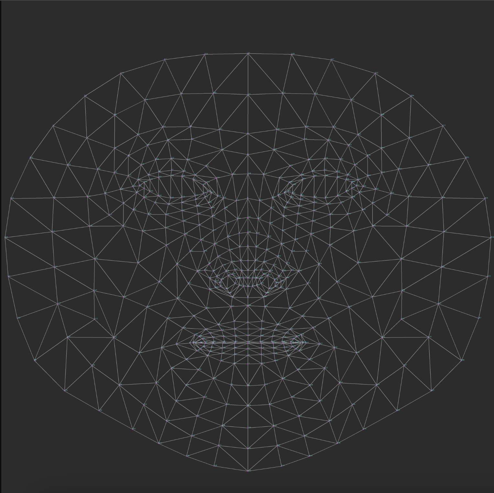
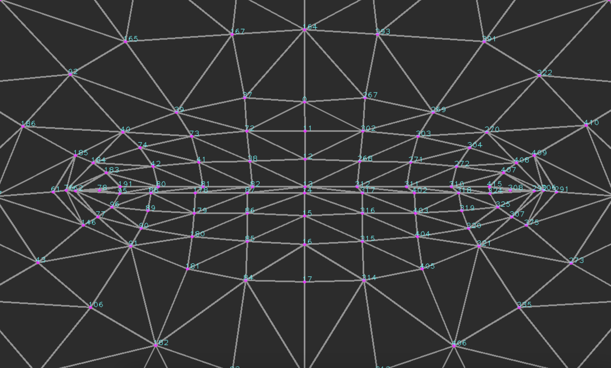

# 🧠 Body and
# 🗣️ Oral
# 📝 Language
# 📚 Learning
# 🧩 Decoder

## BOLLD leverages body language, lip transcriptions and reinforcement learning to detect threats in real-time.

### A Multi-Modal Approach to Real-Time Threat Detection Using Computer Vision and Natural Language Processing

### Team Members:
- Nicole Sorokin
- Julia Brzustowski
- Zuhair Qureshi
- Grady Rueffer
- Sophia Shantharupan

## 🚀 Use Cases  

### 🔒 **Security Applications**  
- Detecting potential **threats** or **violent language** when **audio** is corrupted or unavailable during meetings. 📞⚠️  
- Aimed at enhancing **safety** and providing an alternative threat detection system that doesn't rely on sound. 🎥🔍  

### 🛡️ **Violence Mitigation**  
- Can be applied in **public safety** scenarios, such as **campus surveillance**, to alert authorities of potential threats in real-time. 🎓🚨  
- **Assistive technology**: Can be implemented in **glasses with cameras** to help people with disabilities, like **blindness**, by notifying them of potential threats they might not visually perceive. 👓🤖👀  

## 🚀 Tech Stack  

  
  
  

### 🎥 Computer Vision  
  
  
  

### 🤖 Machine Learning  
  
  

### 🖼️ Frontend  
  

### 📊 Visualization & Data Processing  
  
  
  
  

### 🧠 Algorithms  
  

Run the app using the following command
```
streamlit run app.py
```

Currently the app.py contains the body language code *training and details about which can be found in the body_lang_decoder folder*, the lip transcription component *details about the model can be found in the lip_to_text folder* where each key word is compared to a list of threatening words and the threat level is calculated. The threat level is then used to determine the state of the system. Passed into the Q-Learning table, the state is used to determine the action to take using reinforcement learning.

## 🚀 High-Level Overview  

### 1️⃣ **First Stage**  
- Use a **trained body language model** 🕺 and **lip reading** (via Mediapipe landmarks) 👄 to compute a **numerical threat probability** (0-1) for each.  
- Combine both values to get a **combined threat score** 🔢.  

### 2️⃣ **Second Stage**  
- Based on the two inputs from the first stage, **train a reinforcement learning model** 🤖 to recognize sequences of actions and lip movements that suggest **malicious behavior**.  
  - **Output:** 0 ➔ **Non-malicious**, 1 ➔ **Malicious**, and a scale (0-1) representing the **threat level** of key words (0 = non-threatening, 1 = threatening).  
- The model will influence the **environment state** 🌍:  
  - **De-escalate** if the threat is correctly identified 🕊️.  
  - **All clear!** if the threat is incorrectly identified 🚨.  

## 📚 Decisions + Documentation  

### 🧠 **Body Language Detection**  
- Using the [**EMOLIPS model**](https://github.com/SMIL-SPCRAS/EMOLIPS) (CNN-LSTM) to detect emotions from lip movement based on face details. 👄😠  
- **Negative emotions** (e.g. anger, disgust) 🥴 can assist in identifying potential threats. ⚠️  
- **Oct 27**: Shifted to a **facial emotion recognition model** using **DeepFace** due to better performance. 🧑‍🎨  
- Integrating body language into a **threat vs. non-threat classification** using [**Mediapipe**](https://www.youtube.com/watch?v=We1uB79Ci-w). 🧑‍💻 The model trains on coordinates from landmarks in frames with associated labels.  
- **Jan 13**: Decided to use **one body language model** (Mediapipe) after facing **multiprocessing conflicts** with running two models simultaneously (initial goal was to get an average). 🤖❌  

### 👄 **Lip Movement to Text**  
- Closely following the methods of [**LipNet**](https://arxiv.org/pdf/1611.01599), as it's proven and well-documented. 📄  
- **Methodology**: Uses **Dlib** for facial landmark detection, preprocessing the GRID dataset, followed by a CNN architecture with bidirectional GRUs. CTC training used for model optimization. 📊  
- **Jan 13**: Switching models as the previous one couldn’t handle live video streams. Transitioning to a more suitable approach (e.g., **Whisper** model) to transcribe lip movement to text, then applying custom models to detect violence levels. 💻  
- **Jan 21**: Exploring a new technique using lip/mouth landmarks to detect **phonemes** and then identify key words stored in a dictionary with associated threat levels. 📖  
- **Jan 27**: Enhanced **LipNet** model to process **live video streams** 🎥 and detect mouth region with **Dlib + ShapePredictor68**.  
- **Jan 29**: Added algorithm to **detect key words** and produce a **violence value**. 🔑  
- **Jan 31**: Integrated into **app.py**. 🎉

## 📅 Rough Milestone Timelines  

### Weeks 1-2:  
- 🚀 **Project Kickoff**: Setup environment and tools  
- 👥 **Task Assignment**  
- 🎯 Define goals and objectives  
- 📊 Data exploration and preparation  
- 🌐 Create basic **frontend** & **backend**  
- 🎥 Set up **OpenCV** for video processing  

### Weeks 3-4:  
- 🔄 Split into **lip reading** and **reinforcement learning (RL)** stages  
- 🤔 Research different models and methods for both stages  
- 💻 Start implementation  

### Weeks 5-6:  
- ✅ Finish **body language** part of stage 1  
- 🌱 Set up **RL environment**  
- 📝 Finish preprocessing for **lip to text** part of stage 1  
- 🔄 Continue implementation of **lip to text** training  

### Weeks 7-8:  
- 🎓 Finish training **lip to text** part of stage 1  
- 🏁 Complete **RL** stage 2  
- 🎥 Create a **demo video**  

### Weeks 8-10:  
- 🔗 Connect stage 1 and 2  
- 🧠 Continue **reinforcement learning** model training  

## ❄️ **AFTER WINTER BREAK**:  

### Weeks 11-13:  
- 🌐 **Frontend & Backend** integration with ML scripts  
- ✅ Finalize **body language model**  
- ✅ Finalize **lip to text model**  
- 🧠 Continue working on **RL**  

### Weeks 13-14:  
- 🔧 Finish **lip to text** model  
- 🔌 Integrate **lip to text** into the main **app.py**  

### Week 15:  
- ✨ Final touches  
- ⚙️ **Improve accuracy** and **fine-tuning**  
- 🖥️ Test the model with **webcam** integration  


Below are the images that contain the key landmarks used to detect the lip area:

### Face Landmarks:


### Getting a closer look at the lip/mouth area:


Additionally, the app.py contains reinforcement learning code, details below:

State Space:
```
def get_state(threatness_level):
    if threatness_level < 0.4:
        return "low"
    elif 0.4 <= threatness_level <= 0.7:
        return "medium"
    else:
        return "high"
```
State space is simplified into three levels (low, medium, high) based on the threat probability from the body language model. This simplifcation allows the learningto be more manageable while still capturing the essential threat levels.

Action Space:
```
actions = ["escalate", "de-escalate"]
```
Action space is simplified into two actions (escalate and de-escalate) based on the current state. This simplifies the learning process as well as the decision making process.

Q-Learning Table:
```
def update_q_table(state, action, reward, next_state):
    if state not in st.session_state.q_table:
        st.session_state.q_table[state] = {a: 0 for a in actions}
    if next_state not in st.session_state.q_table:
        st.session_state.q_table[next_state] = {a: 0 for a in actions}
    
    st.session_state.q_table[state][action] += learning_rate * (
        reward + discount_factor * max(st.session_state.q_table[next_state].values()) - 
        st.session_state.q_table[state][action]
    )
```
The Q-Learning table is a dictionary that stores the Q-values for each state-action pair. The Q-values are updated based on the current state, action, reward, and next state. The Q-values are used to determine the best action to take in the next state.

Action Selection:
```
def choose_action(state):
    if np.random.rand() < epsilon:
        return np.random.choice(actions)
    if state in st.session_state.q_table:
        return max(st.session_state.q_table[state], key=st.session_state.q_table[state].get)
    return np.random.choice(actions)
```
The action selection process is based on the current state and the Q-Learning table. The action selection process is random if the exploration rate is high, and based on the Q-values if the exploration rate is low. The Q-values are updated based on the current state, action, reward, and next state.

Reward Calculation:
```
if action == "escalate":
    reward = -1 if threatness_level < 0.5 else 1
else:
    reward = 1 if threatness_level < 0.5 else -1
```
The reward calculation is based on the current action and the threat probability. (Add more info on how the reward is calculated.)

### Benefits of using reinforcement learning:
- Learning from trial and error it improves the accuracy of the model.
- It allows for adaptation to new situations.
- The reward system provides immediate feedback about the appropriateness of actions.
- Continuously improve its decision-making based on experience.
- and many more to be added soon...


### 🏗️ Next Steps:
1. Evaluate the performance of the reinforcement learning model and create some graphs to visualize the learning process.
2. Create a decision making tree that shows all the possible actions and their outcomes and how the rl model learns from this/chooses its actions.
3. Update research doc (currently in progress).
4. Update process flow diagram.
